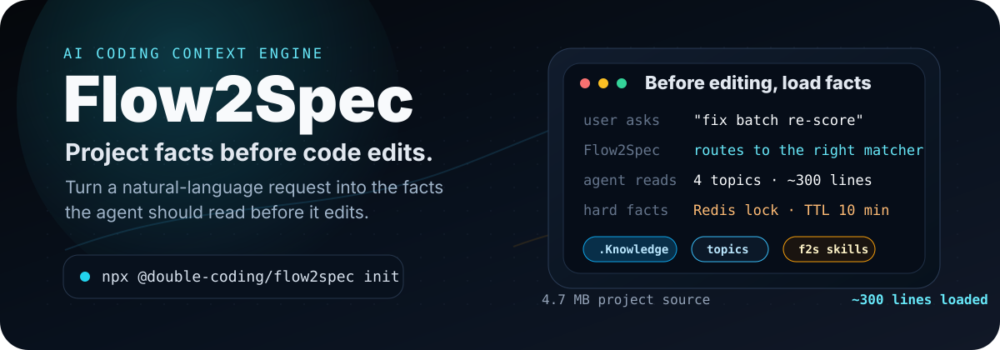

# Flow2Spec

> ## ⚠️ This package has moved
>
> **`@double-codeing/flow2spec` is deprecated** — the organization name had a typo.
>
> Future updates will be published on **`@double-coding/flow2spec`** (same code, correct org name).
>
> ```bash
> npm uninstall -g @double-codeing/flow2spec
> npm install -g @double-coding/flow2spec
> ```
>
> Or one-shot via npx:
>
> ```bash
> npx @double-coding/flow2spec@latest init
> ```
>
> This is the last release under `@double-codeing`. All future work will happen at [`@double-coding/flow2spec`](https://www.npmjs.com/package/@double-coding/flow2spec).

---

<p align="center">
  
</p>

<p align="center">
  <strong>Give Cursor, Claude Code, and Codex the project facts they need before editing.</strong>
</p>

<p align="center">
  <a href="./README.zh-CN.md">中文</a> ·
  <a href="https://double-coding-lab.github.io/Flow2Spec">Live demo</a> ·
  <a href="./docs/en/Flow2Spec-Introduction.md">Introduction</a> ·
  <a href="./docs/en/usage-guide.md">Usage guide</a> ·
  <a href="./docs/en/commands-reference.md">Commands</a>
</p>

<p align="center">
  
  
  
  
</p>

Flow2Spec adds a spec-driven workflow layer to AI coding agents. It creates a small, routable `.Knowledge/` knowledge base, installs agent-specific `f2s-*` skills, and keeps optional local task state separate from product knowledge. A new session can load the facts relevant to a request instead of rediscovering the repository.

```bash
npx @double-codeing/flow2spec@latest init
```

Try the current beta:

```bash
npx @double-codeing/flow2spec@beta init
```

## Why it exists

Without a maintained, routable project memory, an agent has to rediscover the same constraints on every request. Flow2Spec keeps those facts in compact topic shards and routes each request to the topics it needs.

| Without Flow2Spec | With Flow2Spec |
| --- | --- |
| “Which module owns this table?” | `[matcher hit] m-product-review-template-library` |
| “Is batchReScore sync or async?” | `[loading deps] 4 topics · ~300 lines` |
| “Is there a lock? What is the idempotency key?” | `Redis lock ... TTL 10 min` |
| Agent searches 416 APIs, 796 files, and 4.7 MB of source before editing. | Agent reads the verified constraints first and opens the relevant files. |

Flow2Spec does not add documentation for its own sake. It keeps a small, machine-readable knowledge layer alongside the code, and lets the same skills update it when verified facts change.

## What you get

| Layer | What it does | Files |
| --- | --- | --- |
| Knowledge routing | Maps a request to the few topics the agent needs to read. | `.Knowledge/manifest-routing.json`, `.Knowledge/matchers/*.json` |
| Topic shards | Stores project facts such as APIs, limits, locks, data rules, and workflows. | `.Knowledge/topics/*.md` |
| Agent entrypoints | Installs rules and skills for Cursor, Claude Code, and Codex. | `.cursor/`, `.claude/`, `.codex/`, `AGENTS.md` |
| Skill workflows | Clarifies requirements, writes specs, implements, fixes, syncs knowledge, and commits. | `f2s-*` skills |
| Team collaboration | Keeps each developer's task state local while merging reviewed knowledge through structured deltas and topic revisions. | `.task/<developerId>/`, `.Knowledge/` |

## Built for shared repositories

Flow2Spec separates collaboration state by ownership. Checklists, session context, and user todos stay under each developer's local `TASK_ROOT` and do not enter Git. Confirmed project knowledge remains shared in `.Knowledge/`.

Knowledge-producing skills write a structured `kb-delta.json` instead of editing topic files directly. Before apply, the CLI compares the delta's `baseRevisions` with the topic revisions on disk. Different topics can merge independently; concurrent changes to the same topic stop for a semantic review after the latest branch state is pulled.

Read the full model in [Team Collaboration](./docs/en/team-collaboration.md).

## First use

After initialization, you do not need to document the whole project upfront. Start with the change you actually need. The agent reads the relevant code and existing docs while it works, then saves confirmed project facts back into the knowledge base.

For an existing project, you can ask the agent to draft the project structure first:

```text
/f2s-doc-arch
```

This helps the agent understand the main directories, module boundaries, and existing conventions. It is optional. For a small change, you can start directly from the request.

## Daily development

Most of the time, describe the task in natural language:

```text
Add batch recalculation. It should retry failed items and avoid running the same batch twice.
```

The agent should look for relevant project knowledge first. If something is missing, it should explain the gap, then read the necessary code or ask you a follow-up question. Confirmed facts such as APIs, limits, locks, data rules, and workflows can be synced back into `.Knowledge`.

A larger change usually follows this path:

```text
describe the requirement
  → agent fills in missing details
  → generate or review the technical spec
  → implement / fix
  → sync verified project facts
  → check knowledge coverage before commit
```

If you already know which workflow you want, use one of the explicit entrypoints below.

## How the knowledge base grows

Flow2Spec's knowledge base is not meant to be finished in one pass. It grows with development:

1. `init` creates the base skeleton.
2. The first time a module matters, the agent reads the relevant code and docs.
3. Confirmed facts from the development process become routable topics.
4. Later similar requests can hit those topics directly instead of searching the whole repository again.

The directories can be read this way:

- `req-docs/`: technical specs and implementation plans for concrete changes.
- `stock-docs/`: stable project background, architecture notes, and imported source material.
- `topics/`: compact facts the agent should actually load.
- `matchers/`: rules that route a user request to the right topics.

## Explicit skill entrypoints

Natural-language requests can select these workflows automatically when intent recognition is enabled. Use the entrypoints below when you want to choose one directly.

| Command | Purpose |
| --- | --- |
| `/f2s-req-clarify` | Clarify missing requirements until the change is unambiguous. |
| `/f2s-req-tech` | Turn confirmed requirements into an implementation-ready technical proposal. |
| `/f2s-kb-feat` | Add a capability and update project knowledge. |
| `/f2s-kb-fix` | Fix behavior and correct the matching knowledge. |
| `/f2s-kb-sync` | Sync already implemented facts into `.Knowledge/`. |
| `/f2s-kb-add <path>` | Import an existing module or document set. |
| `/f2s-git-commit` | Check changed files and knowledge coverage before committing. |

Full references:

- [Usage guide](./docs/en/usage-guide.md)
- [Commands reference](./docs/en/commands-reference.md)
- [Directory conventions](./docs/en/directory-conventions.md)
- [Architecture and principles](./docs/en/architecture.md)
- [Team collaboration](./docs/en/team-collaboration.md)
- [Design principles](./docs/en/design-principles.md)
- [Project milestones](./docs/en/milestones.md)

## When not to use it

Flow2Spec is useful when context drift is expensive. It may be unnecessary for:

- throwaway one-off scripts;
- tiny solo projects where one `CLAUDE.md` is enough;
- teams that will not keep `.Knowledge/` aligned with the code.

## Learn more

- [Flow2Spec Introduction](./docs/en/Flow2Spec-Introduction.md) — product narrative, diagrams, and comparison with ordinary project memory.
- [Flow2Spec 基础介绍](./docs/Flow2Spec基础介绍.md) — Chinese long-form introduction.
- [Live demo](https://double-coding-lab.github.io/Flow2Spec) — 13-slide HTML presentation.

## License

[MIT](./LICENSE)
