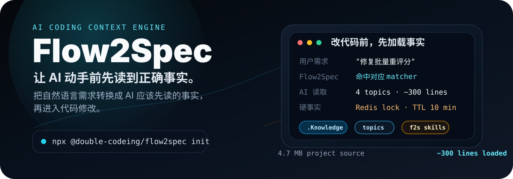

# Flow2Spec

<p align="center">
  
</p>

<p align="center">
  <strong>让每个已初始化的 AI 编程客户端在动手改代码前，先读到正确的项目事实。</strong>
</p>

<p align="center">
  <a href="./README.md">English</a> ·
  <a href="https://double-coding-lab.github.io/Flow2Spec">在线演示</a> ·
  <a href="./docs/Flow2Spec基础介绍.md">基础介绍</a> ·
  <a href="./docs/使用说明.md">使用说明</a> ·
  <a href="./docs/命令说明.md">命令说明</a> ·
  <a href="https://github.com/orgs/double-coding-lab/projects/2/views/1">路线图</a>
</p>

<p align="center">
  
  
  
</p>

Flow2Spec 是给 AI 编码工具使用的 Spec-driven 工作流层。它会在项目里建立小而可路由的 `.Knowledge/` 知识库，安装面向 agent 的 `f2s-*` 技能，并把可选的本地任务状态和产品知识分开保存。新的会话可以按需求加载相关事实，而不是重新翻完整个仓库。

```bash
npx @double-coding/flow2spec@latest init
# DeepSeek Harness 原生插件：
# https://github.com/double-coding-lab/Flow2Spec-DeepSeek-Harness
# 未装插件时的项目级适配：
flow2spec init dsh
```

## 为什么需要它

如果项目记忆不能维护、不能路由，agent 每次处理需求都要重新确认同一批约束。Flow2Spec 把这些事实整理成紧凑的 topic 分片，再把需求路由到需要读取的主题。

| 没有 Flow2Spec | 有 Flow2Spec |
| --- | --- |
| “这个模块的表在哪？” | `[matcher 命中] m-product-review-template-library` |
| “batchReScore 是同步还是异步？” | `[加载依赖] 4 个 topic · 约 300 行` |
| “有没有锁？幂等键是什么？” | `Redis lock ... TTL 10 min` |
| Agent 在修改前搜索 416 个接口、796 份文件、4.7 MB 源码。 | Agent 先读取已验证约束，再打开相关文件。 |

Flow2Spec 不是为了增加文档数量。它把项目事实保存在一层小而准的机读知识里，并让同一套技能在事实变化后同步更新它。

## 它提供什么

| 层 | 作用 | 文件 |
| --- | --- | --- |
| 知识路由 | 把一次需求映射到 agent 需要读取的少量 topics。 | `.Knowledge/manifest-routing.json`, `.Knowledge/matchers/*.json` |
| 主题分片 | 保存 API、上限、锁、数据规则、业务流程等项目事实。 | `.Knowledge/topics/*.md` |
| Agent 入口 | 为选中的 AI 编程客户端安装规则和技能。 | 客户端配置根、`.dsh/`、`AGENTS.md` |
| 技能工作流 | 澄清需求、编写方案、实现、修复、同步知识、提交。 | `f2s-*` skills |
| 团队协作 | 每个人的任务现场留在本地，确认后的知识通过结构化 delta 与 topic revision 合入共享仓库。 | `.task/<developerId>/`, `.Knowledge/` |

## 多人共用一份知识库

Flow2Spec 按所有权拆分协作状态。checklist、会话上下文和用户代办保存在每名开发者自己的 `TASK_ROOT`，默认不进 Git；已经确认的项目知识统一进入 `.Knowledge/`。

知识类技能先生成结构化 `kb-delta.json`，不直接改 topic。真正 apply 前，CLI 会比较 delta 的 `baseRevisions` 与磁盘上的 topic revision。修改不同 topic 可以分别合入；两个人同时修改同一 topic 时，后合入的一方需要先拉取最新版本、重读语义，再改写 delta。

完整流程见 [团队协作](./docs/团队协作.md)。

## 第一次怎么用

初始化以后，不需要先把整个项目文档补齐。更推荐的方式是从当前要处理的需求开始，让 Agent 在开发过程中读取真实代码和已有文档，再把确认过的项目事实沉淀下来。

如果这是一个已有项目，可以先让 Agent 整理一次项目结构：

```text
/f2s-doc-arch
```

这一步会帮助 Agent 理解主要目录、模块边界和已有约定。它不是必选步骤；如果只是处理一个很小的修改，也可以直接从需求开始。

## 日常开发怎么用

大多数时候，直接用自然语言说明要处理的事情即可：

```text
帮我新增一个批量重算功能，需要支持失败重试，并且不要重复执行同一批任务。
```

Agent 会先根据规则查找相关项目知识。如果信息不够，它应该先说明缺口，再读取必要代码或反问你。实现过程中确认下来的接口、限制、锁、数据规则等事实，会在合适的时候同步回 `.Knowledge`。

较大的需求通常按这个顺序推进：

```text
说明需求
  → Agent 补齐缺失信息
  → 生成或复核技术方案
  → 实现 / 修复
  → 同步已验证的项目事实
  → 提交前检查知识库覆盖情况
```

如果你已经知道要走哪个流程，可以直接输入下面的显式入口。

## 知识库会怎么增长

Flow2Spec 的知识库不是一次性整理完的。它会随着开发逐步变完整：

1. `init` 先生成基础骨架。
2. 第一次处理某个模块时，Agent 读取相关代码和文档。
3. 开发过程中确认下来的事实，会被整理成可路由的主题。
4. 后续再处理相似需求时，Agent 可以直接命中这些主题，不需要重新翻完整个仓库。

目录可以简单理解为：

- `req-docs/`：某次具体变更的技术方案和实现计划。
- `stock-docs/`：稳定的项目背景、架构说明和导入材料。
- `topics/`：Agent 实际会读取的精简事实。
- `matchers/`：把用户需求路由到对应 topics 的匹配规则。

## 显式技能入口

开启意图识别后，自然语言需求可以自动选择这些工作流。下面这些入口适合在你想明确指定流程时使用。

| 命令 | 用途 |
| --- | --- |
| `/f2s-req-clarify` | 补齐缺失信息，直到变更目标没有明显歧义。 |
| `/f2s-req-tech` | 把已确认的需求整理成可实现的技术方案。 |
| `/f2s-kb-feat` | 新增能力，并同步项目知识。 |
| `/f2s-kb-fix` | 修复行为，并更正对应知识。 |
| `/f2s-kb-sync` | 把已实现事实同步进 `.Knowledge/`。 |
| `/f2s-kb-add <path>` | 导入已有模块或文档集。 |
| `/f2s-git-commit` | 提交前检查变更文件和知识覆盖情况。 |

完整参考：

- [使用说明](./docs/使用说明.md)
- [命令说明](./docs/命令说明.md)
- [目录与路径约定](./docs/目录与路径约定.md)
- [体系与原理](./docs/体系与原理.md)
- [团队协作](./docs/团队协作.md)
- [设计说明](./docs/设计说明.md)
- [项目里程碑](./docs/项目里程碑.md)

## 什么时候不适合

Flow2Spec 适合上下文漂移成本较高的项目。下面这些场景可能不需要它：

- 写完就删的一次性脚本；
- 很小的个人项目，一份 `CLAUDE.md` 已经够用；
- 团队不愿意让 `.Knowledge/` 和代码保持同步。

## 继续了解

- [Flow2Spec 基础介绍](./docs/Flow2Spec基础介绍.md) — 产品叙事、配图、与普通项目记忆的区别。
- [Flow2Spec Introduction](./docs/en/Flow2Spec-Introduction.md) — 英文长文介绍。
- [在线产品介绍](https://double-coding-lab.github.io/Flow2Spec) — 网站式产品导览，快速了解核心能力与使用路径。

## 协议

[MIT](./LICENSE)
