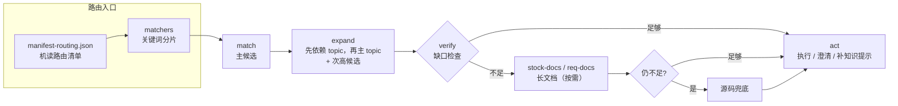
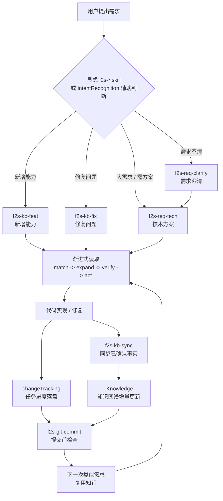
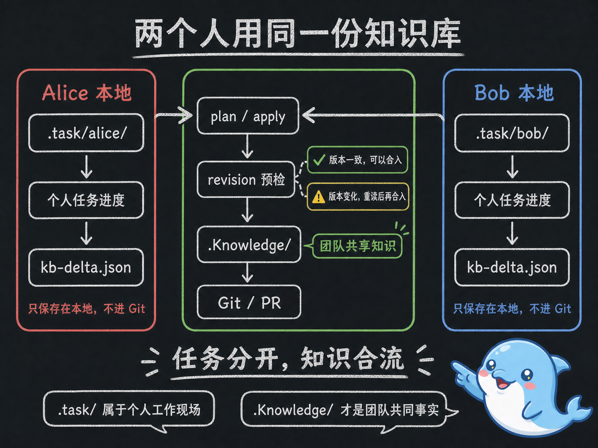
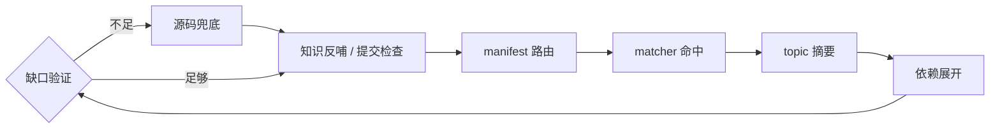
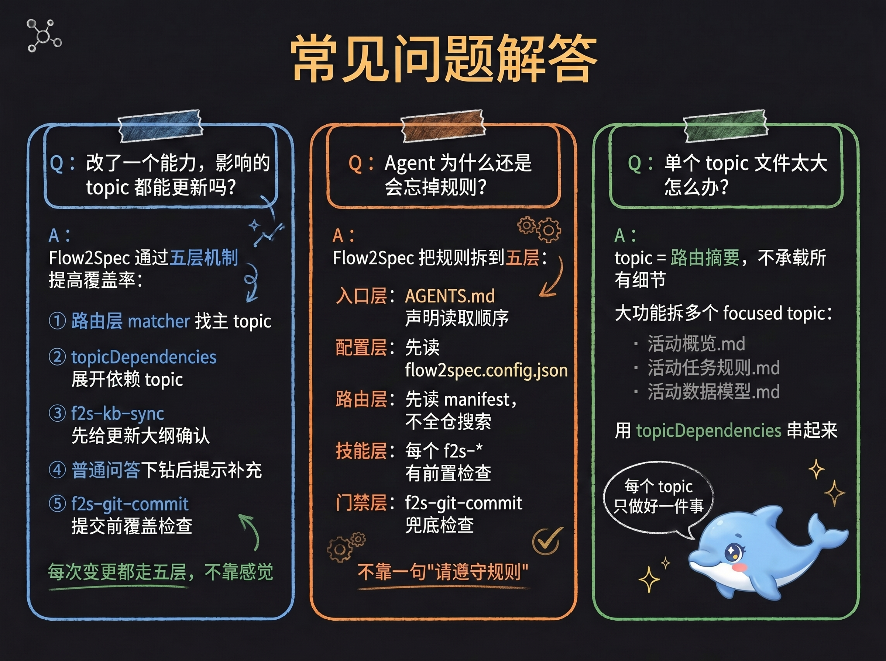

[中文](./Flow2Spec基础介绍.md) | [English](./en/Flow2Spec-Introduction.md) · [项目首页](../README.zh-CN.md) | [Project home](../README.md)

# Flow2Spec：让项目在开发中自然长出知识图谱

<p></p>

---

## 一、前言

<p></p>

最近一年，很多 AI 编程工具都在解决同一个问题：**让 Agent 记住项目上下文。**

这件事当然重要。但现在只说"项目记忆""上下文管理""规则文件"，已经不够了。

因为很多开源项目都在做类似的事：写一个 `AGENTS.md` / `CLAUDE.md`，加一组 rules，建一个 docs 目录，让 Agent 先读项目说明，或者接入向量库做检索。

这些方案能缓解问题，但我真正想解决的不是"启动时塞给 AI 一堆上下文"。我想解决的是：

**在真实开发过程中，项目知识能不能被持续沉淀、自动路由、持续验证，并且随着代码一起演进。**

这就是 Flow2Spec。一句话介绍：**Flow2Spec 是一个让项目在开发过程中自然长出知识图谱的 Agent 工程框架。**

---

## 二、只做"记忆"为什么不够

<p></p>

很多项目接入 AI 后，会很快遇到一个悖论：你希望 AI 多了解项目，但你给它的上下文越多，它越容易读不完、读偏、忘掉重点。

于是大家不断加规则：先读这个文件，再读那个目录，这个模块不能改，那个接口有历史兼容，改完记得更新文档……最后上下文变成另一种负担。它看起来像知识库，实际上更像一个不断膨胀的说明书。

Flow2Spec 的判断是：**项目知识不能只靠"写下来"，还要能被路由、被组合、被校验、被持续更新。**

---

## 三、Flow2Spec 的关键差异：开发过程生成知识图谱

<p></p>

Flow2Spec 不是要求你先做一场大规模文档工程。它更推荐的方式是：

1. 先 `flow2spec init` 初始化一个空骨架

2. 用 `f2s-doc-arch` 生成项目架构说明，沉淀进知识库

3. 真实需求来了，Agent 先按现有知识路由

4. 功能实现后，用 `f2s-kb-sync` 把本轮确认的事实同步回知识库

5. 下一次类似需求，再从这份知识中渐进读取

**知识不是一次性建设出来的。它是在需求澄清、技术方案、代码实现、修复问题、知识同步、提交代码的过程中逐步长出来的。**

这也是 Flow2Spec 和普通"项目记忆文件"的区别：普通方案更像给 Agent 一份说明书；Flow2Spec 更像给项目维护一张可演进的知识图谱——落在仓库里的 `.Knowledge/` 中，能 diff、能 review、能随代码提交。

---

## 四、知识库接口：不是一个大文档，而是一套路由协议

<p></p>

Flow2Spec 的知识库有一个明确的接口结构：

```Plain Text
.Knowledge/
  manifest-routing.json   # 机读路由清单
  matchers/               # 关键词分片
  topics/                 # 主题摘要
  stock-docs/             # 已落地能力长文档
  req-docs/               # 需求 / 技术方案文档

```

Agent 的读取顺序不是自由发挥，而是按协议走：

```Plain Text
manifest-routing.json
  -> matcher 分片（matcherPath 指向的单个文件）
  -> match（主候选）
  -> expand（先依赖 topic，再主 topic；保留次高候选）
  -> verify（缺口检查）
      -> 足够：act
      -> 不足：stock-docs / req-docs（按需）
          -> 仍不足：源码兜底
          -> act 或澄清
```

图 1：知识库渐进式读取



这套结构的价值在于：**知识库对 Agent 暴露的不是"文件"，而是"怎么找到正确知识"的接口。**

`manifest-routing.json` 告诉 Agent 有哪些主题；`matchers/*.json` 告诉 Agent 这个需求可能命中哪些主题；`topics/*.md` 给 Agent 短摘要和硬约束；`topicDependencies` 告诉 Agent 哪些前置规则必须一起读；`stock-docs/` 和 `req-docs/` 只在需要时下钻。

---

## 五、渐进式读取：AI 每次只拿该拿的知识

<p></p>

Flow2Spec 的读取模型可以概括成四步：**match → expand → verify → act**

**match**：Agent 先读 `manifest-routing.json`，再按任务读取对应 matcher 分片。不遍历整个知识库，先缩小候选范围。

**expand**：命中主主题后，通过 `topicDependencies` 继续读取依赖主题，避免只看到局部规则。比如一个功能可能同时依赖公共配置规则、鉴权规则、某个业务模块的约束。

**verify**：命中 topic 不代表知识一定够。Flow2Spec 要求 Agent 在执行前检查：当前主题是否真的覆盖用户问题，是否缺关键依赖，是否需要读长文档，是否需要先反问用户。这一步把"看起来命中了"变成"确认可以执行"。

**act**：只有在知识覆盖足够、边界清楚时，Agent 才进入实现、修改或提交。如果置信度不足，就先澄清，而不是硬改。

---

## 六、多依赖能力：不让 Agent 只读到一半规则

<p></p>

真实项目里，很多错误不是因为 AI 完全没读知识，而是它只读了一个局部知识，漏掉了前置约束：

- 改功能时读了业务 topic，但没读提交规则

- 生成技术方案时读了需求文档，但没读 req\-docs / stock\-docs 的边界规则

- 修改配置时读了模块说明，但没读配置开关默认值

Flow2Spec 把这些依赖显式放进路由层。一个 topic 可以声明它依赖哪些 topic，Agent 命中主主题时会先展开依赖。这不是简单的"多读几个文件"，而是把项目知识从扁平文档变成有边的图：

```Plain Text
需求实现
  -> 文档路由规则
  -> 技术方案规则
  -> 任务追踪规则
  -> Git 提交规则

```

这让 Agent 每次读取的不是孤立片段，而是一组经过声明的上下文组合。

---

## 七、知识库正确性：不是写了 topic 就算完

<p></p>

知识库最怕两件事：过期和写错。Flow2Spec 没有假设知识库永远正确，它把"验证"放进了开发流程。

典型场景：用户问一个业务细节，Agent 先查知识库，发现 topic 有覆盖但不够细，继续读源码得到更准确的事实。这时 Flow2Spec 不应该只回答完就结束，还要判断：

- 这个事实是否已经写进 topic

- 如果没写或不够细，是否应该提示用 `f2s-kb-distill` 把本轮问答提取入库

- 如果知识看起来已覆盖，是否能证明覆盖来源；不能证明就不能静默

这就是"知识库补充建议收口"。**它让 AI 从源码里找到的每次新知识，都不只留在本次聊天里，而是反哺回知识库。**

---

## 八、用户意图识别：不是所有话都应该自动进流程

<p></p>

用户说一句话，Agent 到底应该回答、讨论、澄清，还是直接进开发流程？

- "这个方案可行吗？" → 应该是讨论，不应该自动开始写代码

- "修一下这个 bug" → 应该进入 fix 流程

- "我想做一个新能力，先帮我把需求问清楚" → 应该进入需求澄清，而不是直接实现

Flow2Spec 里有 `intentRecognition` 开关，开启后 Agent 会按意图识别规则做辅助判断：高置信新增能力进入 feat 流程，高置信修复问题进入 fix 流程，需求不清楚进入 req\-clarify，只是询问/讨论则保持普通对话。

经过一段时间真实项目验证，**意图识别已经比较稳定，建议默认开启**，让 Agent 在大多数场景下自动分流；当然你也可以随时显式输入 `f2s-req-clarify`、`f2s-kb-feat`、`f2s-kb-fix` 等命令，覆盖自动判断结果。建议多显式使用 f2s\-\* skill**，熟悉这些技能的用法，可以更高效地使用 Flow2Spec。

---

## 九、一个更真实的开发流程

<p></p>

使用 Flow2Spec 后，一个需求可能是这样流动的：

```Plain Text
用户提出需求
  -> 显式 f2s-* skill / intentRecognition 辅助判断
  -> f2s-req-clarify 反问到无歧义
  -> f2s-req-tech 生成技术方案
  -> Agent 按知识库渐进读取
  -> 实现代码
  -> changeTracking 记录任务进度
  -> f2s-kb-sync 同步新知识
  -> f2s-git-commit 提交前检查

```

图 2：开发过程生成知识图谱



这条链路里，每一步都会留下可追踪的资产：需求文档在 `req-docs/`，已落地知识在 `stock-docs/`，主题摘要在 `topics/`，路由关系在 `manifest-routing.json`，任务进度在 `.task/`。

**Flow2Spec 做的不是"让 AI 单次回答更好"，而是在把一次次开发过程转化为项目知识图谱的增量更新。**

---

## 十、它不只管知识，也管开发过程

<p></p>

**任务进度落盘**：开启 `changeTracking` 后，Agent 执行功能开发或方案实现时，会把任务 checklist 写到 `.task/`。新会话继续做时，不需要重新问"上次做到哪"，直接从磁盘任务接上。

**技术方案不硬套模板**：`f2s-req-tech` 会根据当前需求选择合适的技术方案结构，而不是把所有章节机械套一遍，避免前端改造也生成一堆数据库章节。

**多 Agent 编排与校验**：复杂任务可以通过 `subAgent` 拆给子 Agent 处理。如果开启 `switchAgentVerification`，还可以让写入方和验证方分离，降低单个 Agent 自己写、自己验、自己放过的风险。

**提交前知识覆盖检查**：`f2s-git-commit` 会在提交前检查 diff、冲突标记、暂存范围，也会检查本轮变更是否需要同步知识库，让"改代码后忘记更新知识"在提交前能被发现。

**模板与路由升级检测**：Flow2Spec 启动时会检测 `.Knowledge/` 结构版本，如果落后于 npm 包版本，Agent 会提示执行 `f2s-kb-upgrade`，确保项目知识结构与工具版本保持同步。

---

## 十一、两个人用同一份知识库

多人协作时，Flow2Spec 不会把两个人的所有状态都合在一起。Alice 和 Bob 各自保留本地任务现场，只有经过确认的知识才进入共享仓库。

<p></p>

图 3：任务分开，知识合流

`.task/` 默认不进 Git，并按 `developerId` 分成不同的 `TASK_ROOT`。Alice 的 Agent 不会为了找续作任务去扫描 Bob 的目录。这里保存的是 checklist、会话上下文和用户代办，它们属于执行者自己的工作现场。

`.Knowledge/` 则必须全员共享。技能先把知识变更写成结构化 delta，里面带着读取时的 topic revision；真正写入前由 `flow2spec kb plan` 检查磁盘版本。两个人改不同 topic 可以各自推进，改到同一个 topic 时，后合入的一方必须拉取最新版本、重新理解语义，再更新 delta。

所以这套协作不是“自动把所有文本拼起来”。它把无需共享的状态隔离掉，把必须共享的事实留在 Git，并在语义可能冲突的位置停下来。完整流程见 [团队协作](./团队协作.md)。

---

## 十二、和普通知识库最大的区别

<p></p>

如果只用一句话概括差异：**普通知识库是给 Agent 查的；Flow2Spec 的知识库是给 Agent 参与维护的。**

图 4：普通记忆文件 vs Flow2Spec 知识图谱




普通知识库关注：文档放在哪里、怎么检索、怎么总结。

Flow2Spec 更关注：需求来了该读哪个主题、主题之间有什么依赖、当前知识是否足够执行、源码兜底后是否要反哺、用户意图是否应该触发流程、改代码后知识是否一起更新、提交前是否检查过知识覆盖。

这也是为什么 Flow2Spec 会同时包含 `.Knowledge/`、`.task/`、`f2s-*` skills、Agent rules 和 `flow2spec.config.json`——它们不是散件，而是一套围绕开发流程组织起来的协议。

---

## 十三、几个常见问题

<p></p>

**Q：改动一个能力后，怎么保证对应主题都能更新？**

Flow2Spec 不承诺「模型一定自动知道所有影响面」，而是把影响面发现变成一套可执行流程。

一次能力改动通常不只对应一个 topic。例如改了「批量重评分」，可能同时影响：

| 类型 | 需检查的内容 |
| --- | --- |
| 业务能力 topic | 这个功能现在怎么工作 |
| 配置 topic | 开关、默认值、阈值有没有变化 |
| 规则 topic | 幂等、锁、错误码、提交前检查有没有变化 |
| 模块 topic | 公共方法、目录边界、调用链有没有变化 |

Flow2Spec 通过五层机制提高覆盖率：

1. 路由层：matcher 找主 topic
2. 依赖展开：`topicDependencies` 展开依赖 topic
3. 同步确认：`f2s-kb-sync` 先给出更新大纲，让用户确认
4. 问答收口：普通问答下钻源码后，发现缺口则提示补充
5. 提交门禁：`f2s-git-commit` 提交前做知识覆盖检查

**举例**：改「活动抽奖次数」时，知识更新不应只写「抽奖接口改了」，还可能要同步：

- 活动业务 topic：抽奖次数怎么计算
- 数据模型 topic：哪些字段记录已领取 / 剩余次数
- 规则 topic：浏览任务、购买任务、重复领取的限制
- 配置 topic：奖品列表、开关、活动时间

> Flow2Spec 的目标不是让 Agent 凭感觉改一个文件，而是先列出「这次变更可能影响哪些主题」，确认后再落盘。

---

**Q：Flow2Spec 怎么解决 Agent 遗忘规则的问题？**

分两侧看。

**使用侧**：规则不塞进一个大文件，而是拆成可路由、可依赖的结构——入口规则写进各端配置、业务知识放进 `topics`、匹配词放进 `matchers`、依赖关系放进 `topicDependencies`、长文档放进 `stock-docs` / `req-docs`。Agent 每次不靠记忆，而是按 `match → expand → verify → act` 重新取规则。

**设计侧**：五层约束分阶段拦截「规则写了但不遵守」的情况：

1. 入口层：声明读取顺序和禁止项
2. 配置层：执行任何技能前必须先读配置开关
3. 路由层：所有任务先读 manifest，不直接全仓搜索
4. 技能层：每个技能定义前置检查、确认点和收口方式
5. 门禁层：在多个节点分别设门禁——任务归档前检查 checklist、知识落盘前确认大纲、问答下钻源码后强制收口自检、代码提交前检查 diff 与知识覆盖

两个典型场景说明这五层如何生效：一是防止意图误判（用户还在澄清阶段，Agent 不能跳去实现）；二是防止源码答完后知识不反哺（必须判断是否需要 `f2s-kb-distill` 把本轮问答提取入库，不允许静默跳过）。

Flow2Spec 的目标不是完全消除遗忘，而是让「绕过规则」在每个阶段都更难发生。

---

**Q：单个主题文件过大怎么办？**

topic 的定位是「路由摘要」：记触发词、边界、关键约束和下一步指针，不承载所有细节。长内容放 `stock-docs/`；大功能拆成多个 focused topic，再用 `topicDependencies` 串起来。

**拆分示例**（一万行代码的大功能）：

```text
topics/
  活动概览.md
  活动任务规则.md
  活动数据模型.md
  活动外部依赖.md

stock-docs/
  活动概述_终稿.md
  活动任务规则_终稿.md
  活动数据模型_终稿.md
  活动外部依赖_终稿.md
```

Agent 先读「活动概览」判断相关性；问任务状态机 → 读「活动任务规则」；问表字段 → 读「活动数据模型」。

这样可避免：topic 太大读不完抓不住重点，或触发词太杂导致一个主题什么需求都命中。

---

**Q：如果知识库没有覆盖当前模块怎么办？**

Flow2Spec 提供三个互补命令，按触发方式与粒度区分：

`f2s-kb-distill` 由 **Agent 自动提示**：在一次问答中下钻源码找到答案后，把本轮问答提取入库；技能内部会按下钻深度与命中主题，自动判新建主题或补充既有主题。

`f2s-kb-add <路径或能力描述>` 由**用户主动**触发：想把一个**整体模块 / 历史能力**一次性解析入库时使用，输入路径或多文件聚合，适合从未入库的整块代码。

`f2s-kb-sync` 由**用户主动**触发：用于已实现能力的**全局 / 批量同步**，可零输入推断，先输出更新大纲再落盘，适合阶段性体检式补强。

简言之：**单次问答 → distill（Agent 自动），新模块整体入库 → add，多个已落地能力一次性同步 → sync**。

> 每次「从源码里找答案」，都可能变成一次知识库补强。

---

## 十四、适合什么项目 \+ 快速体验

<p></p>

**最适合**：中大型业务项目、长期维护的代码仓库、多人协作规则很多的项目、经常使用 Cursor / Claude Code / Codex 的团队、希望 AI 不只是"看文档"而是参与维护项目知识的场景。

**可能不适合**：一次性脚本或非常小的个人项目（\< 5000 行，一份 README 够用）。

**5 分钟快速体验**：

```Plain Text
npx @double-coding/flow2spec@latest init

```

开始使用时建议优先显式输入`f2s-*` skill，熟悉这些技能的用法，可以更高效地使用 Flow2Spec。默认开启 `intentRecognition` 即可让 Agent 在常见任务下自动分流。

常用流程：

```Plain Text
/f2s-req-clarify   需求澄清
/f2s-req-tech      生成技术方案
/f2s-kb-feat       新增能力并同步知识
/f2s-kb-fix        修复问题并修正知识
/f2s-kb-add <路径>  解析已有模块入库
/f2s-kb-sync       全局/批量同步已落地能力到知识库
/f2s-kb-distill    把本轮问答提取入库（自动判新主题或补充既有主题）
/f2s-git-commit    提交前检查并生成提交信息

```

目前已支持 Cursor、Claude Code、Codex 三端初始化，也支持中文 / 英文模板。

---

## 结语

AI 编程不只是让模型生成代码。长期项目里更难的是让 AI 持续读取正确上下文，并把开发过程中确认的新事实同步回项目知识库。

Flow2Spec 做的事，是把项目知识整理成可路由、可依赖、可验证的主题和匹配规则。Agent 处理需求时先读取相关事实；事实变化后，再通过对应技能更新知识库。

如果项目里已经出现这些情况，可以先在一个仓库里试用：

- 每次都要向 AI 解释同一套业务规则；
- AI 容易漏掉前置约束；
- 文档和代码开始不同步。

```Plain Text
npx @double-coding/flow2spec@latest init
```

开源地址：`https://github.com/double-coding-lab/Flow2Spec`

在线产品介绍：`https://double-coding-lab.github.io/Flow2Spec`

---
